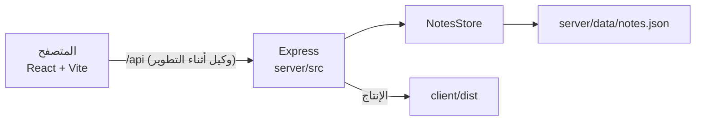

# البنية

تطبيق الملاحظات مشروع صغير بمساحات عمل npm: واجهة React تتحدث مع واجهة REST على Express. التخزين ملف JSON على القرص، وليس قاعدة بيانات.



## مساحات العمل

| المسار | الحزمة | الدور |
| --- | --- | --- |
| `client/` | `@notes-app/client` | واجهة React 18 + Vite 6 |
| `server/` | `@notes-app/server` | واجهة Express 4 ومخزن الملفات |
| جذر المستودع | `notes-app` | سكربتات مشتركة وESLint وTypeScript |

`npm run dev` في الجذر يشغّل العمليتين معاً عبر `concurrently`.

## مسار الطلب

**التطوير**

1. افتح `http://localhost:5173`.
2. الواجهة تستدعي `/api/...` من نفس الأصل.
3. Vite يحوّل `/api` إلى `VITE_API_TARGET` (الافتراضي `http://127.0.0.1:3001`).
4. إذا توقف الخادم، يعيد الوكيل `502` `{ "error": "api unreachable" }` بدل التعليق.

**الإنتاج**

1. `npm run build` يبني الخادم (`server/dist`) والواجهة (`client/dist`).
2. `npm start` يشغّل `node dist/index.js` من مساحة عمل الخادم.
3. إذا وُجد `client/dist/index.html`، يقدّم Express التطبيق وملفات `/assets` المُجزَّأة (تخزين طويل). المسارات ذات الامتداد الناقصة تعيد `404`؛ بقية GET/HEAD تسقط إلى `index.html`.

## التخزين

`NotesStore` (`server/src/notesStore.ts`) يحتفظ بالملاحظات في `Map`، ويعكسها إلى JSON عند تمرير مسار ملف.

- الملف الافتراضي: `server/data/notes.json` (يمكن تجاوزه بـ `NOTES_DATA_FILE`).
- الكتابة ذرية: كتابة `notes.json.<pid>.tmp` ثم `rename`.
- فشل الكتابة يعيد حالة الذاكرة ويعيد `503`.
- الملف غير الموجود يُعامل كمخزن فارغ.
- الملف التالف، أو قيمة JSON ليست مصفوفة، أو السجلات الباطلة (عنوان فارغ، حقول أطول من الحد، تواريخ سيئة، معرّفات مكررة) تضبط `loadFailed`. الملاحظات الصالحة تبقى في الذاكرة؛ **لا يُكتب فوق الملف** حتى إصلاحه.
- حالة الصحة `persist` تكون `ok` أو `degraded` أو `unavailable` حسب ذلك العلم وعدد الملاحظات المحمّلة.
- `tsx watch` يستثني `server/data` حتى لا تعيد عملية الحفظ تشغيل الخادم.

## سلوك الواجهة

| الموضوع | المكان | السلوك |
| --- | --- | --- |
| اللغة | `client/src/i18n.ts` و`index.html` | `navigator.languages`؛ العربية (`ar` / `ar-*`) → RTL ونصوص عربية، وإلا الإنجليزية |
| البحث | `normalizeForSearch` | NFKD، إزالة التشكيل اللاتيني/العربي، توحيد الألف/الياء/الكاف/التاء المربوطة، الأرقام الشرقية → ASCII، طي المسافات |
| التحقق | `client/src/App.tsx` | العنوان 200 حرف، النص 8000؛ يطابق الواجهة |
| التصدير | `client/src/exportNotes.ts` | ينزّل الملاحظات المطابقة JSON أو Markdown عبر عنوان blob |
| التحميل | `App.tsx` | يعيد المحاولة عند أخطاء الشبكة/`502`/`504` في التحميل الأول؛ زر إعادة المحاولة إذا فشلت القائمة |
| السلامة | `App.tsx` | تأكيد قبل الحذف؛ تحذير عند النموذج غير المحفوظ / `beforeunload`؛ Escape يلغي التعديل |

العميل يحلّل أجسام الواجهة بصرامة (`parseNote` / `parseNotes`) حتى لا تكسر سجلّة تالفة القائمة.

## الاختبارات وCI

- العميل: Vitest + Testing Library + jsdom (`client/src/*.test.ts(x)`)
- الخادم: Vitest + Supertest (`server/src/*.test.ts`)
- CI (`.github/workflows/ci.yml`): Node 20 و22 يشغّلان `npm ci` ثم typecheck وlint وtest وbuild

أوامر مفيدة:

```bash
npm test
npm run typecheck
npm run lint
npm run build
```
