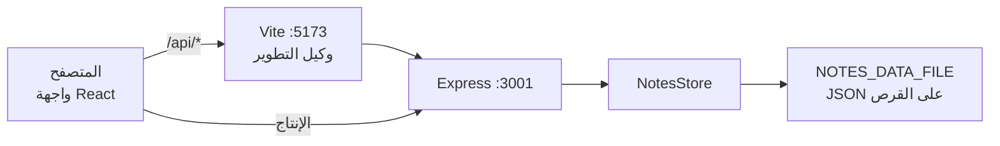

# البنية

[English](architecture.md) · [README](../README.ar.md) · [واجهة البرمجة](api.ar.md)

## مساحات العمل

مساحات عمل npm (`package.json`) تضم `@notes-app/client` و `@notes-app/server`.
الأوامر في الجذر (`dev`، `test`، `build`، `start`) تفوّض إلى هذه الحزم.

| الوضع | مسار الطلبات |
| --- | --- |
| `npm run dev` | المتصفح يخاطب Vite على `:5173`. Vite يوجّه `/api` إلى `VITE_API_TARGET` (الافتراضي `http://127.0.0.1:3001`). إذا توقف الخادم يرجع الوكيل `502` `{ "error": "api unreachable" }`. |
| `npm start` بعد `npm run build` | Express يستمع على `PORT`، وعندما يوجد `client/dist/index.html` يقدّم تطبيق الصفحة الواحدة. التوجيه من جهة العميل يعود إلى `index.html`؛ الأصول ذات التجزئة الناقصة ترجع `404` بدل الغلاف. |

## الخادم

| الملف | الدور |
| --- | --- |
| `server/src/index.ts` | يقرأ `PORT` و `HOST` و `NOTES_DATA_FILE`؛ ينشئ `NotesStore`؛ يقدّم `client/dist` اختيارياً |
| `server/src/app.ts` | CORS، محلل JSON، المسارات، الملفات الثابتة، تعيين الأخطاء |
| `server/src/notesStore.ts` | معرفات UUID، التحقق، `Map` في الذاكرة، حفظ JSON ذري |
| `server/src/exportNotes.ts` | توليد إخراج JSON/Markdown |

`tsx watch` يستثني `server/data` و `*.tmp` حتى لا تعيد كتابة الحفظ تشغيل العملية.

### خوارزمية الحفظ

1. عند الإقلاع يُحلَّل مصفوفة JSON. تُتخطى السجلات غير الصالحة أو المكررة.
2. إذا تُخطّي أي شيء أو تعذر قراءة الملف تُضبط `loadFailed`.
3. عند الإنشاء/التحديث/الحذف يُطبَّق التغيير في الذاكرة، يُكتب
   `<file>.<pid>.tmp`، ثم تُعاد تسميته إلى المسار الحقيقي.
4. إذا فشلت الكتابة يُتراجع `Map` في الذاكرة ويُرمى `PersistError`
   (`503`).
5. طالما `loadFailed` مضبوطة تُرفض الكتابة حتى لا يُستبدل ملف تالف.

`ValidationError` → HTTP `400`. `PersistError` → HTTP `503`.

## العميل

| الملف | الدور |
| --- | --- |
| `client/src/App.tsx` | النموذج، القائمة، البحث، الإخراج، التعديل/الحذف، إعادة المحاولة، حماية التغييرات غير المحفوظة |
| `client/src/api.ts` | غلاف `fetch`، `ApiError`، تحليل دفاعي لأجسام الملاحظات |
| `client/src/i18n.ts` | اكتشاف اللغة، النصوص العربية/الإنجليزية، `normalizeForSearch` |
| `client/src/exportNotes.ts` | نفس أشكال JSON/Markdown في الخادم، مع تنزيل عبر Blob |

العميل لا يثق بالسلك كما هو: `parseNotes` يسقط العناصر التالفة ويفشل إذا كانت
الاستجابة غير فارغة ولا تحتوي أي ملاحظة صالحة.

### اللغة والبحث

`detectLocale()` يستخدم `navigator.languages[0]` ثم `navigator.language`.
الوسم `ar` و `ar-*` يختار النصوص العربية و `dir="rtl"` على `<html>`.

`normalizeForSearch` يطبّق Unicode NFKD، التحويل لأحرف صغيرة، إزالة علامات
الجمع والتشكيل العربي والتطويل، طي أشكال الألف/الهمزة/الياء/الكاف/التاء
المربوطة، تحويل الأرقام العربية الشرقية والفارسية إلى ASCII، ودمج المسافات.
البحث مطابقة جزء من النص بعد التوحيد على العنوان أو النص.

### فرق الإخراج عن واجهة البرمجة

إخراج الواجهة يستخدم القائمة **المفلترة** (`matchingNotes`). مسار HTTP يخرج
المخزن كاملاً دائماً.

## الاختبارات

Vitest يغطي مساحتي العمل:

- الخادم: `supertest` ضد `createApp`، مع اختبارات الوحدة للمخزن والإخراج.
- العميل: React Testing Library للواجهة، مع اختبارات `api` / `i18n` / الإخراج.

التكامل المستمر (`.github/workflows/ci.yml`) يشغّل فحص الأنواع والـ lint
والاختبار والبناء على Node 20 و 22.

## بيئة Cloud Agent

`.cursor/environment.json` يثبت بـ `.cursor/install.sh` (`npm ci`) ويشغّل
`dev:server` و `dev:client`. المنافذ المنشورة `5173` (الواجهة) و `3001`
(واجهة البرمجة).
