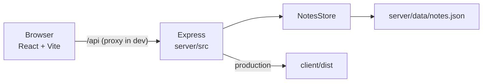

# Architecture

Notes is a small npm-workspaces app: a React SPA talks to an Express REST API. Persistence is a JSON file on disk, not a database.



## Workspaces

| Path | Package | Role |
| --- | --- | --- |
| `client/` | `@notes-app/client` | React 18 + Vite 6 UI |
| `server/` | `@notes-app/server` | Express 4 API + file store |
| repo root | `notes-app` | Shared scripts, ESLint, TypeScript |

Root `npm run dev` starts both processes with `concurrently`.

## Request path

**Development**

1. Open `http://localhost:5173`.
2. The UI calls `/api/...` on the same origin.
3. Vite proxies `/api` to `VITE_API_TARGET` (default `http://127.0.0.1:3001`).
4. If the API is down, the proxy returns `502` `{ "error": "api unreachable" }` instead of hanging.

**Production**

1. `npm run build` compiles the server (`server/dist`) and the client (`client/dist`).
2. `npm start` runs `node dist/index.js` from the server workspace.
3. If `client/dist/index.html` exists, Express serves the SPA and hashed `/assets` (long cache). Paths with a file extension that are missing return `404`; other GET/HEAD routes fall back to `index.html`.

## Persistence

`NotesStore` (`server/src/notesStore.ts`) keeps notes in a `Map` and, when constructed with a path, mirrors them to JSON.

- Default file: `server/data/notes.json` (override with `NOTES_DATA_FILE`).
- Writes are atomic: write `notes.json.<pid>.tmp`, then `rename`.
- A failed write rolls back the in-memory change and returns `503`.
- A missing file is treated as an empty store.
- A corrupt file, a non-array JSON value, or invalid records (empty title, over-length fields, bad dates, duplicate ids) sets `loadFailed`. Valid notes stay in memory; the file is **never overwritten** until it is repaired.
- Health `persist` is `ok` / `degraded` / `unavailable` based on that flag and whether any notes loaded.
- `tsx watch` excludes `server/data` so saving a note does not restart the API.

## Client behavior

| Concern | Where | Behavior |
| --- | --- | --- |
| Locale | `client/src/i18n.ts`, `index.html` | `navigator.languages`; Arabic (`ar` / `ar-*`) → RTL + Arabic copy, otherwise English |
| Search | `normalizeForSearch` | NFKD, strip Latin/Arabic diacritics, unify alef/yeh/kaf/teh marbuta, Eastern digits → ASCII, collapse spaces |
| Validation | `client/src/App.tsx` | Title 200, body 8,000; matches the API |
| Export | `client/src/exportNotes.ts` | Downloads matching notes as JSON or Markdown via a blob URL |
| Load | `App.tsx` | Retries network/`502`/`504` on first load; Retry button if the list failed |
| Safety | `App.tsx` | Confirm before delete; warn on dirty form / `beforeunload`; Escape cancels edit |

The client parses API payloads strictly (`parseNote` / `parseNotes`) so a bad record cannot crash the list.

## Tests and CI

- Client: Vitest + Testing Library + jsdom (`client/src/*.test.ts(x)`)
- Server: Vitest + Supertest (`server/src/*.test.ts`)
- CI (`.github/workflows/ci.yml`): Node 20 and 22 run `npm ci`, typecheck, lint, test, and build

Useful commands:

```bash
npm test
npm run typecheck
npm run lint
npm run build
```
