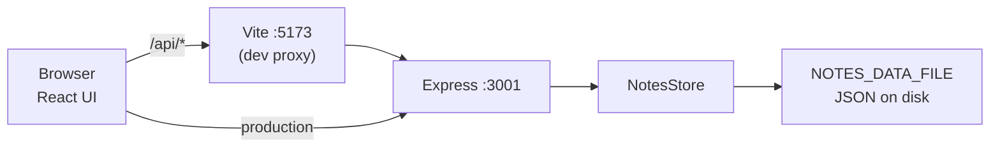

# Architecture

[العربية](architecture.ar.md) · [README](../README.md) · [API](api.md)

## Workspaces

npm workspaces (`package.json`) contain `@notes-app/client` and
`@notes-app/server`. Root scripts (`dev`, `test`, `build`, `start`) delegate to
those packages.

| Mode | How traffic flows |
| --- | --- |
| `npm run dev` | Browser talks to Vite on `:5173`. Vite proxies `/api` to `VITE_API_TARGET` (default `http://127.0.0.1:3001`). If the API is down, the proxy returns `502` `{ "error": "api unreachable" }`. |
| `npm start` after `npm run build` | Express listens on `PORT` and, when `client/dist/index.html` exists, serves the SPA. Client-side routing falls back to `index.html`; hashed assets that are missing return `404` instead of the shell. |

## Server

| File | Role |
| --- | --- |
| `server/src/index.ts` | Reads `PORT`, `HOST`, `NOTES_DATA_FILE`; constructs `NotesStore`; optionally serves `client/dist` |
| `server/src/app.ts` | CORS, JSON parser, routes, static files, error mapping |
| `server/src/notesStore.ts` | UUID ids, validation, in-memory `Map`, atomic JSON persistence |
| `server/src/exportNotes.ts` | JSON/Markdown export rendering |

`tsx watch` excludes `server/data` and `*.tmp` so a persist write does not
reload the process.

### Persistence algorithm

1. On startup, parse the JSON array. Skip invalid or duplicate records.
2. If anything was skipped or the file was unreadable, set `loadFailed`.
3. On create/update/delete, apply the change in memory, write
   `<file>.<pid>.tmp`, then `rename` onto the real path.
4. If the write fails, roll the in-memory `Map` back and throw `PersistError`
   (`503`).
5. While `loadFailed` is set, refuse writes so a corrupt file is never
   overwritten.

`ValidationError` → HTTP `400`. `PersistError` → HTTP `503`.

## Client

| File | Role |
| --- | --- |
| `client/src/App.tsx` | Form, list, search, export, edit/delete, retries, dirty-state guards |
| `client/src/api.ts` | `fetch` wrapper, `ApiError`, defensive parsing of note payloads |
| `client/src/i18n.ts` | Locale detection, English/Arabic copy, `normalizeForSearch` |
| `client/src/exportNotes.ts` | Same JSON/Markdown shapes as the server, plus blob download |

The client never trusts the wire blindly: `parseNotes` drops malformed items
and fails closed if a non-empty response contains zero valid notes.

### Locale and search

`detectLocale()` uses `navigator.languages[0]` (then `navigator.language`).
Tags `ar` and `ar-*` select Arabic copy and `dir="rtl"` on `<html>`.

`normalizeForSearch` applies Unicode NFKD, lowercasing, stripping combining
marks and Arabic tashkeel/tatweel, folding alef/hamza/yeh/kaf/teh-marbuta
variants, mapping Eastern Arabic and Persian digits to ASCII, and collapsing
whitespace. Search is substring match on the normalized title or body.

### Export difference vs API

The UI export uses the **filtered** list (`matchingNotes`). The HTTP export
endpoint always dumps the full store.

## Tests

Vitest covers both workspaces:

- Server: `supertest` against `createApp`, plus store and export unit tests.
- Client: React Testing Library for the UI, plus `api` / `i18n` / export tests.

CI (`.github/workflows/ci.yml`) runs typecheck, lint, test, and build on Node
20 and 22.

## Cloud Agent environment

`.cursor/environment.json` installs with `.cursor/install.sh` (`npm ci`) and
starts `dev:server` plus `dev:client`. Published ports are `5173` (UI) and
`3001` (API).
